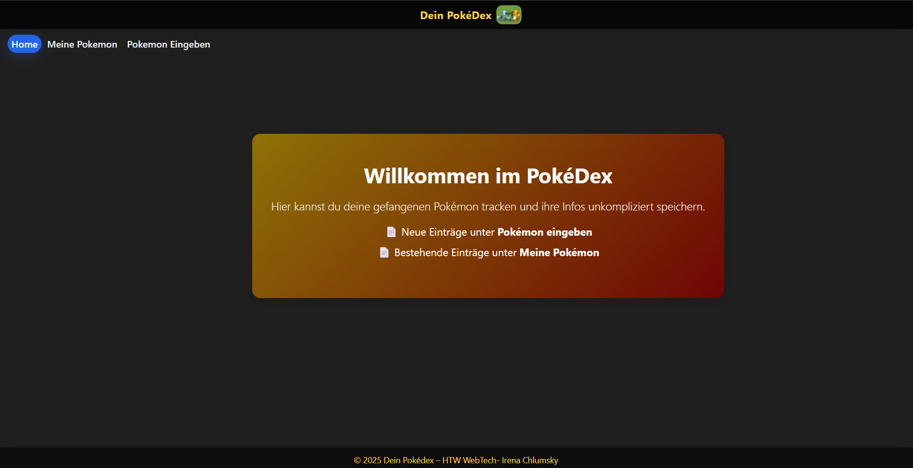

 # Pokedex- Semesterarbeit

Dieses Projekt ist die Semesterarbeit im Modul Webtechnologien an der HTW Berlin.  
Es handelt sich um eine Angular-Anwendung, die einen Pokedex mit CRUD-Funktionalitäten bereitstellt. 
Die Anwendung ermöglicht es gefangene Pokemon in den Pokemon Spielen zu Tracken. 

- Frontend: Angular, Bootstrap
- Backend: Node.js, Express  
- Datenbank: MongoDB 

**Features**

- Pokémon-Liste mit Filter nach Name und Typ  
- Formular zum Anlegen neuer Pokémon  
- Speicherung im MongoDB-Backend  
- Löschen von Einträgen mit Bestätigungs-Dialog (Toast)  
- Responsives Design mit Bootstrap  

**Voraussetzungen**

Node.js
Angular CLI (falls nicht installiert: npm install -g @angular/cli)
Git (zum Klonen des Repositories)
MongoDB

*Repository clonen:*
git clone https://github.com/IrenaChlumsky/WebTech.git

*Frontend starten:*
cd WebTech/Semesterarbeit
npm install
ng serve

*Backend starten:*
cd WebTech/SemesterarbeitBackend
npm install
node server.js  

**Anwendung im Browser starten**

http://localhost:4200

**KI- Nutzung:**

*Chat GPT* 
 - Fehlerbehebung(Debugging): Unterstützung bei der Analyse und Korrektur von Fehlern in Angular- und TypeScript-Code.
 - LayoutHilfe: Tipps und Vorschläge für CSS-Anpassungen, responsives Design und die optische Gestaltun
 - Verständnisfragen: Erklärungen zu Angular-Konzepten (Komponenten, Services, Lifecycle Hooks), Backend-Anbindung (Express, MongoDB) und  Projektstruktur.
 - Projektplannung und Chronologie: Unterstützung bei der Strukturierung des Arbeitsablaufs 

## Screenshots:

**Startseite**

**PokemonListe**

**Formular**

## Autorin
Irena Chlumsky  
HTW Berlin – Modul Webtechnologien

 
